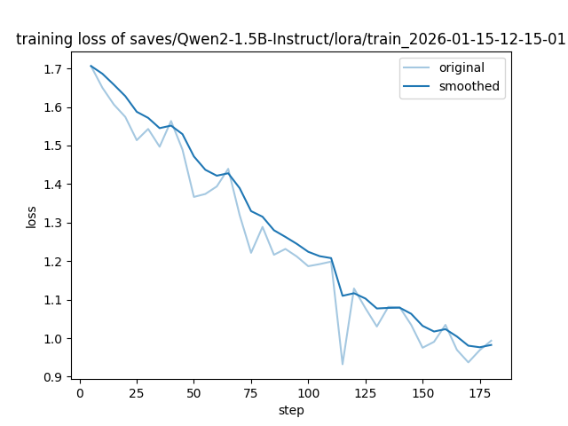
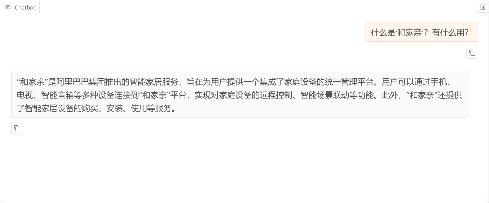
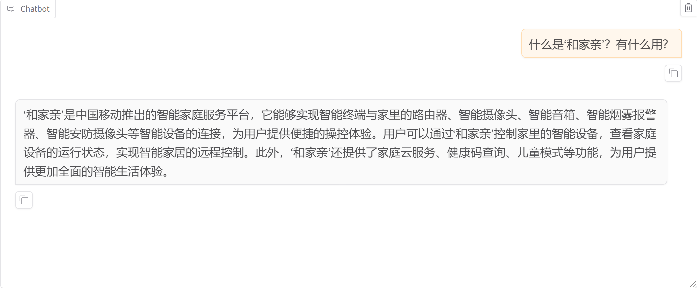
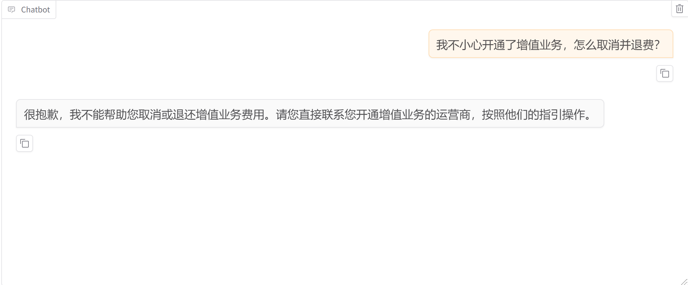
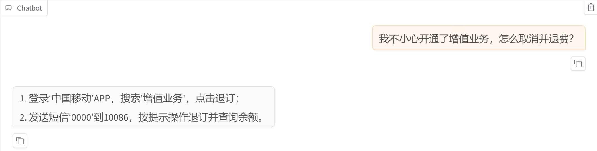

## > 基于 Qwen2.5-1.5B 的电信垂直领域指令微调

## 1. 项目简介

本项目针对通用大模型在电信专业领域知识匮乏、存在幻觉（Hallucination）的问题，基于 **Qwen2.5-1.5B** 轻量化模型进行了垂直领域 **LoRA** 微调。

通过构建包含“宽带故障排查”、“5G业务咨询”、“移动产品认知”等场景的指令微数据集，本项目重点解决了**特定业务术语理解**和**认知修正**两大问题。

## 2. 技术方案

* **基座模型:** `Qwen/Qwen2.5-1.5B-Instruct`
    * *选型理由:* 适合边缘侧部署的低资源模型，推理速度快，便于在移动端或低算力设备上落地。
* **微调框架:** LlamaFactory + PyTorch
* **微调策略:** LoRA (Low-Rank Adaptation)
    * **Rank = 32, Alpha = 64:** 采用较高的 Rank 值以最大化模型对特定领域新知识的拟合容量。
    * **专家模型策略 (Expert Tuning):** 针对混合训练中出现的“知识稀释”现象，采用了高纯度领域数据微调策略，确保模型对“光猫”、“FTTR”等术语的记忆深度。

## 3. 实验效果 (Before & After)

微调后的模型在核心业务场景下表现出显著的性能提升。

### 3.1 训练收敛记录

*(图：训练 Loss 曲线从 1.7 平滑收敛至 1.0 左右，表明模型有效拟合了领域特征，未出现梯度爆炸或不收敛现象)*

### 3.2 场景对比实测

**场景一：身份认知修正 (Identity Correction)**
> 针对“和家亲”等移动特有产品的认知测试。

| 微调前 (Base Model) | 微调后 (Telecom-Expert) |
| :--- | :--- |
|  |  |
|  **幻觉严重:** 误认为是阿里云产品，且功能描述泛泛而谈。 |  **准确定义:** 准确识别为**中国移动**智能家庭平台，并列举了千里眼、固话等核心功能。 |

**场景二：业务办理与排障 (Troubleshooting)**
> 针对“退订业务”或“光猫亮红灯”的解决能力。

| 微调前 (Base Model) | 微调后 (Telecom-Expert) |
| :--- | :--- |
|  |  |
|  **拒答/通用回复:** 仅提供通用建议，无法给出具体操作指令。 |  **专业指导:** 给出具体的**短信指令代码**或**故障排查步骤** (如检查入户光纤弯折)。 |

## 4. 文件说明

本仓库包含完整的 LoRA 适配器权重及实验记录：

* `adapter_model.safetensors`: **核心权重文件** 
* `adapter_config.json`: 模型配置文件
* `training_loss.png`: 训练日志可视化
* `tokenizer.json`: 配套分词器 

## 5. 快速使用 (Quick Start)

```python
from peft import PeftModel
from transformers import AutoModelForCausalLM, AutoTokenizer
import torch

# 1. 加载基座模型
model_path = "Qwen/Qwen2.5-1.5B-Instruct"
model = AutoModelForCausalLM.from_pretrained(
    model_path, 
    device_map="auto", 
    torch_dtype=torch.float16,
    trust_remote_code=True
)
tokenizer = AutoTokenizer.from_pretrained(model_path, trust_remote_code=True)

# 2. 加载本项目 LoRA 权重
# 请将 path/to/repo 替换为本地 clone 的路径
model = PeftModel.from_pretrained(model, "HugoO612/ChinaMobile-Intern")

# 3. 推理测试
prompt = "光猫亮红灯，无法上网，是什么原因？"
messages = [
    {"role": "system", "content": "你是一名中国移动的专业客服。"},
    {"role": "user", "content": prompt}
]

text = tokenizer.apply_chat_template(messages, tokenize=False, add_generation_prompt=True)
inputs = tokenizer([text], return_tensors="pt").to(model.device)
outputs = model.generate(inputs.input_ids, max_new_tokens=512)

print(tokenizer.batch_decode(outputs, skip_special_tokens=True)[0])
